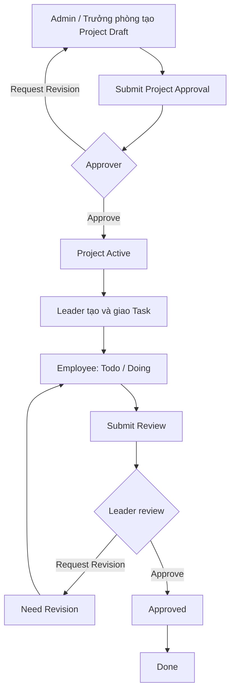
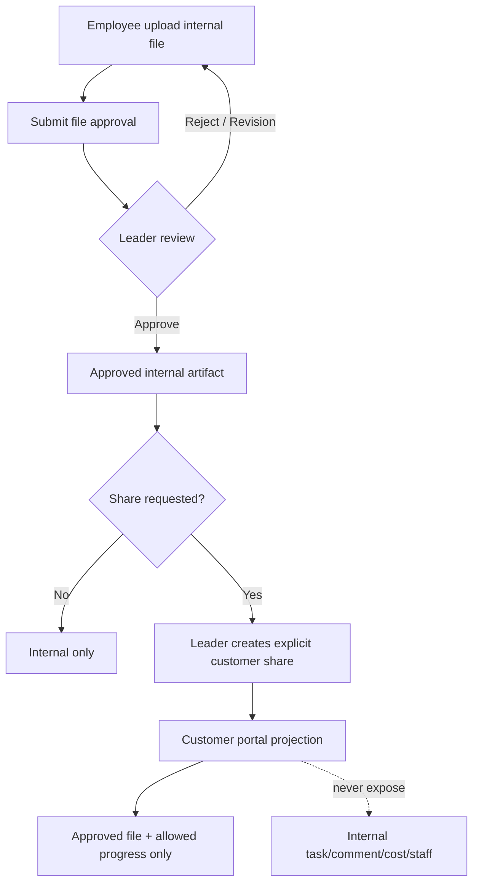

# PGS HUB V1 — Production Audit & Hardening Report

Ngày audit: 2026-08-26  
Phạm vi: Next.js web, NestJS API, Supabase PostgreSQL/Auth, Vercel, cPanel Passenger, RBAC/data scope, project/task/workflow, GPS, security và performance.

## Executive outcome

PGS HUB hiện có nền tảng kỹ thuật tốt và production đang phục vụ được, nhưng chưa đạt điều kiện “production-ready hoàn chỉnh” cho 50–200 nhân sự. Database hardening đã được áp dụng lên Supabase production; code hardening đã pass toàn bộ quality gate và tạo được artifact cPanel. Bản code mới chưa được deploy lên Vercel/cPanel tại thời điểm báo cáo.

Release phải giữ trạng thái **HOLD** cho đến khi hoàn tất bốn điều kiện: rotate Google OAuth secret đã từng xuất hiện trong workspace, gán department cho trưởng phòng đang thiếu scope, bật leaked-password protection, và deploy + smoke/UAT bản API/web mới.

## 1. System Health Report

| Module | Current problem / evidence | Severity | Solution / status |
|---|---|---:|---|
| Frontend production | `https://hub.pgsagency.vn` trả HTTP 200 từ Vercel | Low | Healthy; bản hardening mới cần deploy |
| Backend production | `/api/v1/health` trả 200; root API trả 404 JSON, không còn trang “It works!” | Low | Healthy |
| cPanel Passenger | Artifact có `app.js` gọi đúng `require('./dist/main.js')`; dependency production được pin | Medium | Build ZIP pass, secret scan pass; cần smoke trên host Node 22.23.0 sau deploy |
| CORS | Production hiện trả 500 cho Origin không hợp lệ, dù không trả ACAO | Medium | Source đã đổi thành 403 `CORS_ORIGIN_DENIED`; chờ deploy API |
| Secret handling | Google OAuth secret thật từng nằm trong `supabase/config.toml` | Critical | Đã thay bằng `env(...)`, thêm scanner vào test; phải rotate credential ngoài hệ thống ngay |
| Authentication | API xác thực bearer token bằng Supabase; Next 16 trước đó dùng middleware cũ | Medium | Đã chuyển sang `proxy.ts`, refresh cookie SSR và `getClaims()` theo contract hiện tại; chờ deploy web |
| Static RBAC | Runtime vẫn dựa chủ yếu vào enum `profiles.role` | High | Đã tạo role/permission/assignment chuẩn hóa; cần phase tiếp theo để permission guard đọc permission động |
| Department scope | Project trước đây không có `department_id`; team leader chỉ thấy membership | High | Column/FK/index đã áp dụng; API đã thêm department scope. Một team leader production chưa có department nên chưa thể bật strict scope hoàn toàn |
| Project lifecycle | Thiếu `pending_approval`, `archived`; delete là hard-delete | High | Status đã thêm; delete project đổi thành archive idempotent, bảo toàn lịch sử; chờ deploy API/web |
| Client lifecycle | Delete công ty có thể xóa membership/project không transaction | Critical | Đã đổi thành deactivate idempotent, bảo toàn project/membership/history; chờ deploy API/web |
| Task model | List/Kanban/Calendar dùng chung bảng `tasks` (đúng), nhưng status thiếu Need Revision/Approved và assignee có thể đưa thẳng Done | High | Giữ datasource chung; cần migration + state machine approval bắt buộc trước Done |
| Workflow approval | Workflow engine có internal/client approval nguyên tử cho stage/item | Medium | Nền tảng tốt, có audit/index/RPC; chưa bao phủ task/file/content/project như một approval policy thống nhất |
| Customer sharing | Client bị chặn khỏi workspace nội bộ (an toàn), nhưng file chưa có approval/visibility/share policy đầy đủ | High | Chưa cho mở rộng quyền client; cần schema + API share explicit, chỉ file/progress đã duyệt |
| GPS attendance | Logic server/RPC xác thực vị trí; production trước audit dùng sai tọa độ và radius 100m | High | Đã áp đúng `20.9840365, 105.7700707`, radius 150m, timezone `Asia/Ho_Chi_Minh` |
| GPS audit trail | Attendance lưu lat/lng/accuracy/timestamp nhưng chưa có distance và device riêng | Medium | Thêm `distance_meters`, device metadata và accuracy policy ở phase attendance hardening |
| API envelope | Error có code/requestId/path chuẩn; success response chưa thống nhất `{success,data,message,error}` | Medium | Không đổi phá vỡ client trong hotfix; triển khai envelope có version/adapter ở phase API consistency |
| Database indexes | Trước audit có 26 FK thiếu index và một duplicate index | High | Đã sửa. Advisor hiện không còn missing-FK/duplicate warning; chỉ còn unused-index INFO do dữ liệu/traffic thấp |
| Database RLS | 68 INFO `rls_enabled_no_policy` | Low | Có chủ đích: bảng backend-only đã revoke anon/authenticated và chỉ grant service role; không tạo policy permissive |
| Password security | Supabase leaked-password protection đang tắt | High | Bật trong Auth settings; cần quyền dashboard, không phải migration SQL |
| Frontend permission UX | Có route/role UI nhưng chưa lấy permission catalog động; form tạo project chưa hoàn thiện department selection | High | Chuyển sang capability payload từ `/me`; ẩn/disable action theo cùng permission được API enforce |
| Quality gates | Lint error, typecheck, unit/e2e/web tests, build đều pass | Low | 773 tests pass; lint `--quiet` pass; production build pass |

## 2. Database Change Plan

### Đã áp dụng production

Migration `20260826024721_production_audit_hardening`:

- Thêm project status `pending_approval`, `archived`.
- Tạo `roles`, `permissions`, `role_permissions`, `user_role_assignments`.
- Seed 5 role, 21 permission, 48 role-permission grant; backfill 2 user assignment đang active.
- Thêm `projects.department_id` FK `ON DELETE RESTRICT`; backfill theo project manager nếu có department.
- Tạo composite/partial index cho project scope.
- Tạo đủ 26 FK index được advisor báo thiếu.
- Xóa một trong hai duplicate index trên `project_service_items`.
- Khóa bốn bảng RBAC theo backend-only model: RLS bật, revoke public/anon/authenticated, service role được CRUD.
- Đặt GPS office đúng tọa độ và bán kính 150m.

### Phải làm tiếp

| Priority | Change | Reason / acceptance |
|---|---|---|
| P0 | Gán `department_id` cho team leader production đang thiếu | Không cho phép team leader vận hành với scope mơ hồ; strict department UAT phải pass |
| P0 | Backfill `projects.department_id`, sau đó cân nhắc `NOT NULL` | Chỉ thực hiện khi mọi project đã được phân phòng và có báo cáo exception |
| P0 | Mở rộng task state machine: `todo → in_progress → review → need_revision/approved → done` | Employee không thể tự hoàn tất bỏ qua reviewer; transition phải atomic trong RPC |
| P0 | Thiết kế approval entity/policy thống nhất hoặc mở rộng workflow approval hiện tại | Bao phủ task/file/content/customer_share/project, chống pending trùng và self-approval |
| P0 | Thêm file visibility + approval + share grant | Client query chỉ thấy explicit approved share; internal comment/task/cost không join vào portal payload |
| P1 | Thêm `attendance_records.distance_meters` và device metadata | Audit trail đầy đủ; backend tính và lưu, không nhận distance do client gửi |
| P1 | Constraint/index cho approval inbox theo approver/status/requested_at | Tối ưu dashboard duyệt 50–200 nhân sự |
| P2 | Đánh giá unused index sau tối thiểu 30 ngày traffic | Không xóa index chỉ vì advisor INFO trên database gần như chưa có dữ liệu |

## 3. API Change Plan

### Đã sửa trong code

- CORS origin bị từ chối bằng HTTP 403 có error code an toàn.
- Team leader có thể tạo/list/detail project trong department scope; cross-department bị từ chối.
- Admin có filter `departmentId`; project DTO/map/select hỗ trợ relation department.
- Project DELETE giữ compatibility endpoint nhưng chuyển semantics sang archive idempotent.
- Client DELETE chuyển sang deactivate idempotent, không xóa dây chuyền dữ liệu.
- Auth request context có `departmentId`; lỗi lookup DB được sanitize.
- Secret boundary scan chạy trước toàn bộ test suite.

### Tiếp theo

1. Tạo `PermissionsGuard` đọc active `user_role_assignments` + `role_permissions`; cache ngắn hạn và revoke-aware.
2. Tách data-scope policy thành service dùng chung cho Projects, Tasks, Files, Reports, Attendance.
3. Bổ sung command API rõ nghĩa: submit task review, approve, request revision, share customer; không cho PATCH status tùy ý.
4. Áp approval transition bằng transaction/RPC để entity state và approval state không lệch nhau.
5. Thêm customer projection endpoints chỉ trả allowlisted fields.
6. Chuẩn hóa response envelope theo version hoặc compatibility interceptor; không làm breaking change âm thầm.
7. Thêm pagination/cursor cho approval inbox, activity log và file list; giữ giới hạn page size ≤ 100.

## 4. Frontend Change Plan

### Đã sửa trong code

- Next.js 16 dùng `proxy.ts`; session cookie được đồng bộ đúng request/response.
- Project types/UI hiểu `pending_approval`, `archived`, department relation.
- Copy hành động destructive đổi thành lưu trữ/ngừng hoạt động và nêu rõ dữ liệu được bảo toàn.
- Client social links được nối xuyên DTO/API/UI theo thay đổi có sẵn trong workspace.

### Tiếp theo

| Priority | Change | Acceptance |
|---|---|---|
| P0 | Capability-driven rendering | Nút create/approve/share/archive chỉ xuất hiện khi `/me` trả capability tương ứng |
| P0 | Department selector và scope badge | Admin chọn department; team leader thấy department khóa cứng và không gửi giá trị khác |
| P0 | Task review UX | Employee chỉ có “Gửi duyệt”; leader có Approve/Request Revision; Done là kết quả sau duyệt |
| P0 | File/customer share UX | Tách Upload, Submit approval, Approve, Share; không có nút Share cho employee |
| P1 | Consistent loading/error/empty states | Mọi list/module có skeleton, retry, correlation ID và empty CTA phù hợp permission |
| P1 | Responsive/UAT | Test 360px, tablet, desktop cho kanban/calendar/dialog/portal |
| P2 | Bundle/cache | Dynamic import màn hình nặng; cache read-only catalog, không cache permission/session nhạy cảm |

## 5. Permission Matrix

Legend: `G` global, `D` department scope, `O` own/assigned, `C` explicitly shared client data, `—` denied.

| Capability | Super Admin | Trưởng phòng | Nhân viên | Kế toán | Khách hàng |
|---|---:|---:|---:|---:|---:|
| System/user configuration | G | — | — | — | — |
| Read projects | G | D | O | G/read | C |
| Create/update/archive project | G | D | — | — | — |
| Manage project members | G | D | — | — | — |
| Create/assign task | G | D | — | — | — |
| Read task | G | D | O | — | — |
| Update own task progress | G | D | O | — | — |
| Review/request revision | G | D | — | — | — |
| Upload file | G | D | O | role-specific | — |
| Approve file/content | G | D | — | — | — |
| Share customer | G | D, approved only | — | — | — |
| Internal comments/activity | G | D | O | role-specific | — |
| Attendance self | G | O | O | O | — |
| Attendance review | G | D | — | G/role-specific | — |
| Finance | G | — | — | G | C, allowlisted documents only |
| Customer portal shared data | G | D | — | role-specific | C |

Lưu ý: catalog trên đã được seed vào database, nhưng runtime permission guard động chưa hoàn thiện; production hiện vẫn cần role guard + các scope check hiện hữu.

## 6. Workflow Diagram

### Project and task target workflow

### File and customer sharing target workflow

Hiện trạng: workflow engine đã hỗ trợ internal/client approval cho workflow stage/item. Task state machine và file/customer projection trong hai sơ đồ vẫn là release work còn thiếu.

## 7. Implementation Plan

| Phase | Scope | Status | Exit criteria |
|---|---|---|---|
| Phase 1 — Core Architecture | deployment, secret boundary, safe lifecycle, schema/index hardening | Completed in code/DB | Tests/build pass; no destructive delete; DB advisor không còn missing FK/duplicate index |
| Phase 2 — RBAC + Scope | normalized catalog, assignments, department project scope | Foundation completed | Còn thiếu dynamic permission guard, data backfill và cross-role UAT |
| Phase 3 — Project + Task | department project lifecycle, shared task datasource | Partial | Còn thiếu full task states và enforced review transition |
| Phase 4 — Approval Workflow | existing workflow approvals plus task/file/content/project/share policy | Partial | Atomic approval coverage, no self-approval, customer projection tests |
| Phase 5 — Attendance | server-side GPS, correct perimeter | Mostly completed | Thêm distance/device persistence và field UAT |
| Phase 6 — Optimization | indexes, pagination, frontend bundle/cache/observability | In progress | 30-day query evidence, load test, error-rate/latency SLO |

## Release evidence

- Secret boundary scan: PASS.
- API lint errors: 0; Web lint errors: 0.
- Typecheck: PASS.
- Tests: 599 API unit + 94 API e2e + 79 web + 1 validation = **773 PASS**.
- Next.js + NestJS production build: PASS.
- cPanel artifact: `artifacts/pgs-hub-api-cpanel.zip`.
- Artifact SHA-256: `e218e94371dd136c032bd259689c1c5d72010578c5d5a2912701d4569e886ac4`.
- Artifact secret scan: PASS.
- Local production-mode smoke: allowed Origin 200 + ACAO; rejected Origin 403 without ACAO.
- Supabase migration applied and verified: `20260826024721_production_audit_hardening`.
- Supabase performance advisor: 0 warning/error; 134 unused-index INFO only.
- Supabase security advisor: one actionable warning (leaked password protection disabled); 68 intentional backend-only RLS INFO.

## Required release sequence

1. Rotate Google OAuth client secret and update Supabase/Vercel/cPanel secret stores.
2. Bật Supabase leaked-password protection.
3. Gán department cho trưởng phòng còn thiếu và backfill project department được xác nhận nghiệp vụ.
4. Deploy API artifact lên cPanel Node 22.23.0, restart Passenger.
5. Smoke API: health 200, root 404, allowed CORS 200, rejected CORS 403, SIGTERM/restart, Socket.IO.
6. Deploy web lên Vercel với public Supabase URL/key và API URL đúng; tuyệt đối không có service/secret key.
7. Chạy UAT bằng 5 role, đặc biệt cross-department, task approval, client isolation và GPS boundary.
8. Chỉ chuyển release từ HOLD sang GO khi toàn bộ P0 ở trên pass.

## External references

- Supabase RLS advisor: https://supabase.com/docs/guides/database/database-linter?lint=0008_rls_enabled_no_policy
- Supabase leaked-password protection: https://supabase.com/docs/guides/auth/password-security#password-strength-and-leaked-password-protection
- Supabase unused-index advisor: https://supabase.com/docs/guides/database/database-linter?lint=0005_unused_index
