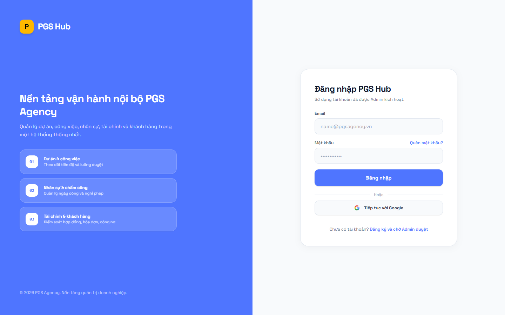
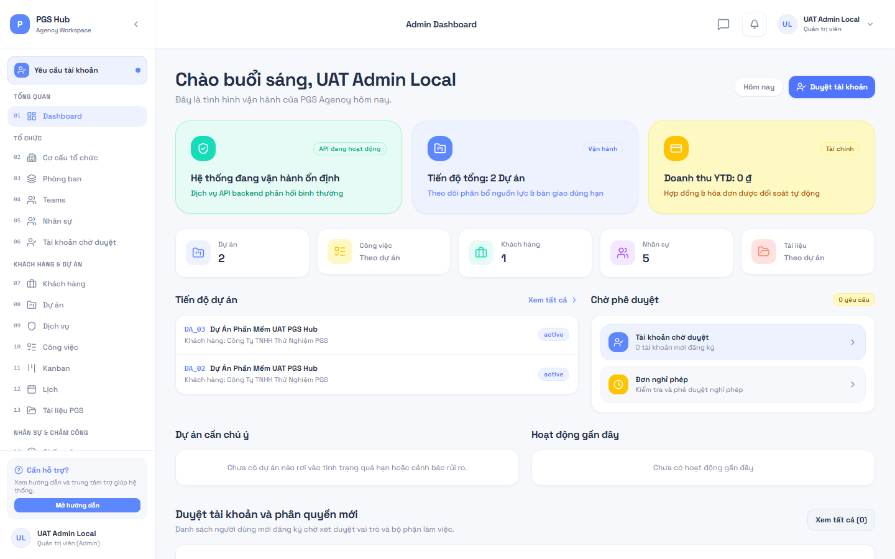
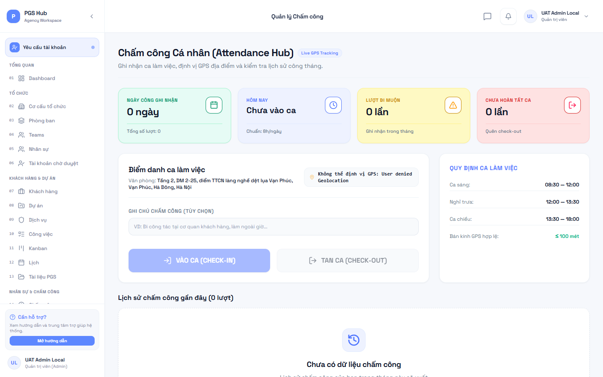
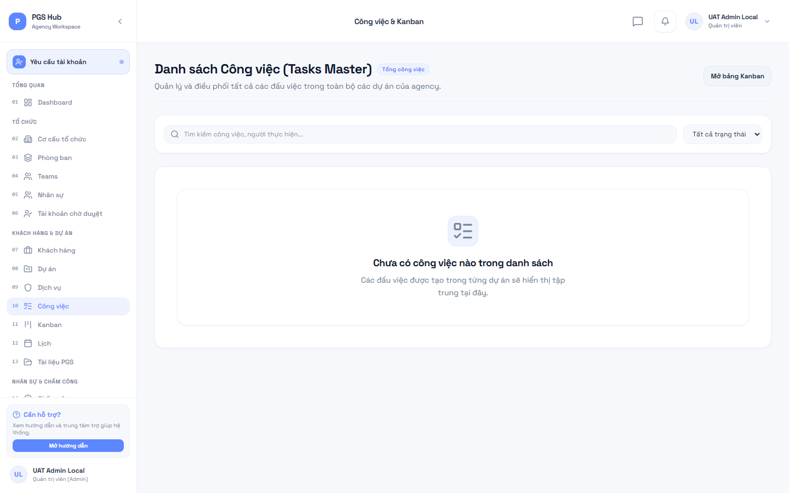
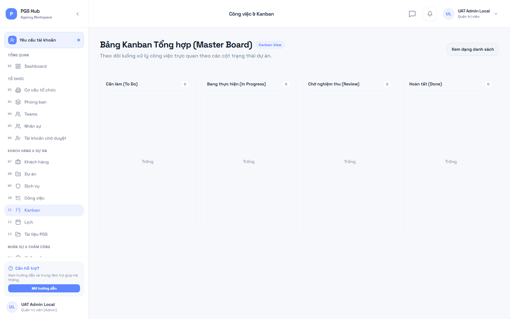
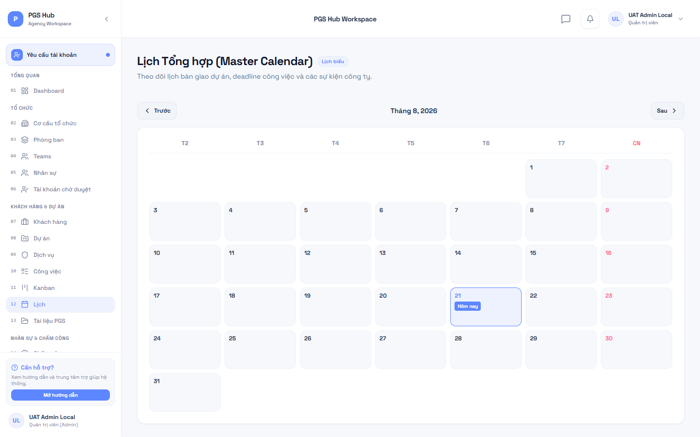
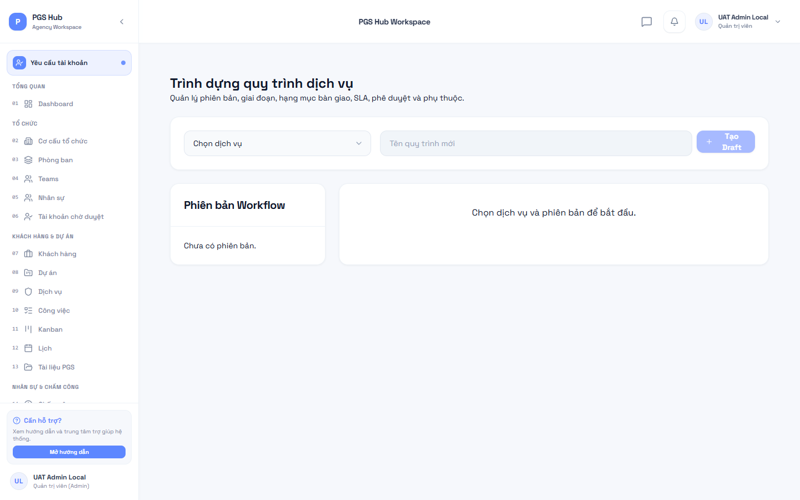
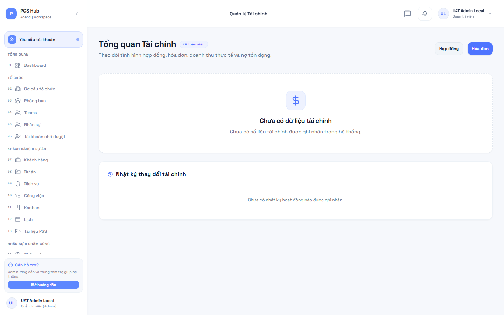
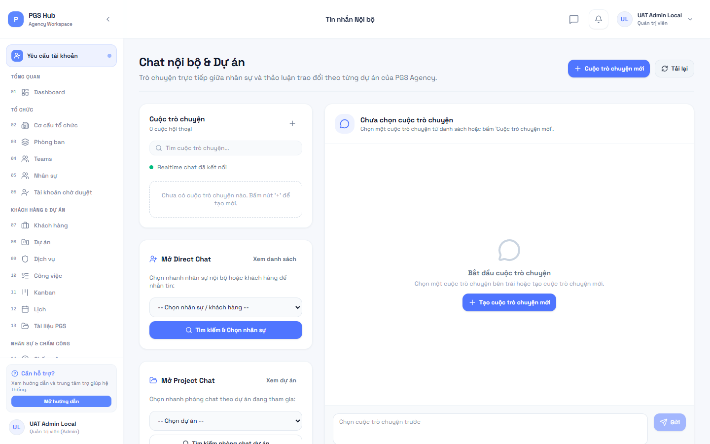

# SỔ TAY HƯỚNG DẪN SỬ DỤNG PGS HUB

_Phiên bản: feat/workflow-engine-v1 | Ngày cập nhật: 21/08/2026_

---

## MỤC LỤC

1. [Đăng Nhập & Bàn Làm Việc](#1-đăng-nhập--bàn-làm-việc)
2. [Chấm Công & Giờ Làm Việc Chuẩn](#2-chấm-công--giờ-làm-việc-chuẩn)
3. [Quản Lý Công Việc & Bảng Kanban](#3-quản-lý-công-việc--bảng-kanban)
4. [Lịch Công Tác & Hạn Chót (Deadlines)](#4-lịch-công-tác--hạn-chót-deadlines)
5. [Quy Trình Dịch Vụ Chuẩn (Workflow Engine v1)](#5-quy-trình-dịch-vụ-chuẩn-workflow-engine-v1)
6. [Quản Lý Chi Phí Dự Án (CP)](#6-quản-lý-chi-phí-dự-án-cp)
7. [Bảng Lương & Phiếu Lương Điện Tử (BL & PL)](#7-bảng-lương--phiếu-lương-điện-tử-bl--pl)
8. [Quản Trị Tài Liệu & Lưu Trữ Doanh Nghiệp (TL)](#8-quản-trị-tài-liệu--lưu-trữ-doanh-nghiệp-tl)
9. [Yêu Cầu Hỗ Trợ & Trao Đổi Thời Gian Thực (YC & Chat)](#9-yêu-cầu-hỗ-trợ--trao-đổi-thời-gian-thực-yc--chat)
10. [Ma Trận Phân Quyền 5 Vai Trò (Roles Matrix)](#10-ma-trận-phân-quyền-5-vai-trò-roles-matrix)

---

## 1. ĐĂNG NHẬP & BÀN LÀM VIỆC

### Màn hình Đăng nhập

- **Vị trí bấm (WHERE TO CLICK)**: Truy cập URL `http://localhost:3000/auth/login`.
- **Giao diện hiển thị (WHAT USER SEES)**: Form đăng nhập với 2 trường Email và Mật khẩu, kèm ảnh minh họa PGS Agency.
- **Dữ liệu nhập (WHAT TO ENTER)**: Email công ty (ví dụ: `uat.employee.local@pgs.test`) và mật khẩu.
- **Kết quả mong đợi (EXPECTED RESULT)**: Đăng nhập thành công, điều hướng về Dashboard tương ứng với vai trò.
- **Lỗi thường gặp (COMMON ERROR)**: Sai email hoặc mật khẩu -> Thông báo "Invalid credentials".
- **Hành động tiếp theo (WHAT TO DO NEXT)**: Bấm "Quên mật khẩu" nếu cần khôi phục mật khẩu.

### Trang Tổng quan (Dashboard)

- **Vị trí bấm**: Menu **Tổng quan** (`/app/dashboard` hoặc `/app/admin`).
- **Giao diện hiển thị**: Các thẻ thống kê nhanh (dự án, nhiệm vụ trong ngày, yêu cầu chờ duyệt, biểu đồ hiệu suất).
- **Hành động tiếp theo**: Chọn mục cần xử lý hoặc bấm vào thẻ công việc để mở chi tiết.

---

## 2. CHẤM CÔNG & GIỜ LÀM VIỆC CHUẨN

- **Vị trí bấm**: Menu **Chấm công** (`/app/attendance`).
- **Giao diện hiển thị**: Đồng hồ thời gian thực, bản đồ vị trí văn phòng, trạng thái chấm công trong ngày và lịch sử chấm công.
- **Quy định giờ giấc chuẩn**:
  - Giờ bắt đầu: `08:00` (Ân hạn 5 phút -> Tính **Đi muộn** từ `08:06` trở đi).
  - Giờ kết thúc: `17:30` (Ân hạn 5 phút -> Tính **Về sớm** nếu trước `17:25`).
  - Địa điểm: Văn phòng Tầng 2, DM 2-25 Vạn Phúc, Hà Đông.
  - _Lưu ý bán kính GPS: LOCAL UAT TEMPORARY VALUE: 100m (Giá trị chính thức trên Production đang PENDING OWNER APPROVAL)._
- **Thao tác**:
  - Bấm **Check-in** vào đầu ca sáng.
  - Bấm **Check-out** khi kết thúc ngày làm việc.
- **Kết quả mong đợi**: Hệ thống ghi nhận chính xác thời gian và cập nhật số phút đi muộn / về sớm tự động.
- **Lỗi thường gặp**: "OUTSIDE_ALLOWED_LOCATION" -> Thiết bị chưa bật định vị GPS hoặc nằm ngoài vùng chấm công.

---

## 3. QUẢN LÝ CÔNG VIỆC & BẢNG KANBAN

### Danh sách Công việc (Tasks)

- **Vị trí bấm**: Menu **Công việc** (`/app/admin/tasks` hoặc `/app/employee/tasks`).
- **Giao diện hiển thị**: Bảng lọc công việc theo dự án, trạng thái, người thực hiện và hạn nộp.
- **Dữ liệu nhập**: Tên công việc, người phụ trách, thời hạn bàn giao, mô tả chi tiết.
- **Kết quả mong đợi**: Công việc mới được tạo, đồng bộ mã nhiệm vụ trên toàn hệ thống.

### Bảng Kanban (Kanban Board)

- **Vị trí bấm**: Menu **Bảng Kanban** (`/app/admin/kanban`).
- **Giao diện hiển thị**: 4 cột trạng thái: **Cần làm (Todo)**, **Đang làm (In Progress)**, **Đang duyệt (Review)**, **Hoàn thành (Done)**.
- **Thao tác**: Kéo và thả thẻ công việc từ cột này sang cột khác để chuyển trạng thái tức thời.

---

## 4. LỊCH CÔNG TÁC & HẠN CHÓT (DEADLINES)

- **Vị trí bấm**: Menu **Lịch biểu** (`/app/admin/calendar`).
- **Giao diện hiển thị**: Khung nhìn theo tháng/tuần hiển thị các hạn chót của dự án và lịch làm việc cách tuần của công ty.
- **Quy tắc lịch**:
  - Thứ 2 đến Thứ 6: Làm việc bình thường.
  - Thứ 7 tuần chẵn: NGHỈ. Thứ 7 tuần lẻ: ĐI LÀM.
  - Chủ nhật: Nghỉ cố định.

---

## 5. QUY TRÌNH DỊCH VỤ CHUẨN (WORKFLOW ENGINE V1)

- **Vị trí bấm**: Menu **Quy trình** (`/app/admin/workflows`).
- **Giao diện hiển thị**: Cây quy trình dịch vụ gồm các Giai đoạn (Stages), Đầu việc chuẩn (Stage Items) và Các cổng duyệt (Approval Gates).
- **Thao tác**:
  1. Tạo Template quy trình gắn với dịch vụ cụ thể.
  2. Thêm các giai đoạn, thiết lập thời hạn SLA và ràng buộc bắt buộc.
  3. Gán các Delivery Items vào giai đoạn.
  4. Bấm **Phát hành (Publish)** và **Đặt làm mặc định (Set Default)**.
  5. Khi khởi tạo dự án, hệ thống tự động sinh quy trình và tạo nhiệm vụ có mã đồng nhất.

---

## 6. QUẢN LÝ CHI PHÍ DỰ ÁN (CP)

- **Vị trí bấm**: Menu **Tài chính / Chi phí** (`/app/admin/finance` hoặc `/app/employee/expenses`).
- **Thao tác tạo đề xuất (Nhân viên)**:
  1. Bấm **Tạo đề nghị chi phí**.
  2. Chọn Dự án, nhập số tiền, phân loại (Công tác, Phần mềm, Thiết bị, Ăn uống...).
  3. Đính kèm biên lai hóa đơn chứng từ.
  4. Bấm **Gửi phê duyệt**. Mã chi phí tự động sinh: `CP_01`, `CP_02`...
- **Thao tác phê duyệt (Kế toán / Admin)**:
  - Xem chi tiết đề xuất và bấm **Duyệt chi phí (Approve)** hoặc **Từ chối (Reject)**.
  - Sau khi chuyển khoản, bấm **Hoàn ứng (Reimburse)** để kết thúc hồ sơ.

---

## 7. BẢNG LƯƠNG & PHIẾU LƯƠNG ĐIỆN TỬ (BL & PL)

- **Vị trí bấm**: Menu **Bảng lương** (`/app/admin/payroll` hoặc `/app/accountant/payroll`).
- **Thao tác tạo kỳ lương (Kế toán)**:
  1. Bấm **Tạo đợt tính lương**.
  2. Chọn tháng (ví dụ: `2026-08`), đặt tiêu đề và số ngày công tiêu chuẩn (mặc định 22 ngày).
  3. Hệ thống tự động tổng hợp ngày công thực tế từ dữ liệu Chấm công, tính toán Lương Gross và Lương Net cho toàn thể nhân viên.
  4. Kế toán kiểm tra, bấm **Phê duyệt đợt lương (Approve)** -> Bấm **Xác nhận chi trả (Mark Paid)**.
- **Thao tác xem phiếu lương (Nhân viên)**:
  - Truy cập `/app/employee/payroll` để xem phiếu lương cá nhân của chính mình.
  - Không thể xem phiếu lương của đồng nghiệp khác (Bảo mật nghiêm ngặt).

---

## 8. QUẢN TRỊ TÀI LIỆU & LƯU TRỮ DOANH NGHIỆP (TL)

- **Vị trí bấm**: Menu **Tài liệu** (`/app/admin/documents`).
- **Thao tác**:
  1. Bấm **Tải lên tài liệu**.
  2. Nhập tiêu đề, phân loại (Chính sách, Hợp đồng mẫu, Tài sản thương hiệu...), chọn mức truy cập (`public_company`, `internal_only`, `management_only`).
  3. Tệp tin được tải trực tiếp lên Supabase Storage bucket an toàn. Mã tài liệu tự sinh: `TL_01`, `TL_02`...
  4. Bấm **Tải về** để nhận đường dẫn có chữ ký bảo mật thời hạn 1 giờ.

---

## 9. YÊU CẦU HỖ TRỢ & TRAO ĐỔI THỜI GIAN THỰC (YC & CHAT)

- **Vị trí bấm**: Menu **Hỗ trợ / Chat** (`/app/chat` hoặc `/app/support`).
- **Thao tác gửi ticket (Khách hàng)**:
  1. Bấm **Tạo yêu cầu hỗ trợ mới**.
  2. Nhập tiêu đề, mô tả vấn đề, mức độ ưu tiên. Mã ticket tự sinh: `YC_01`, `YC_02`...
- **Thao tác phản hồi (Trưởng nhóm / Kỹ thuật)**:
  - Trả lời tin nhắn trực tiếp với khách hàng hoặc tạo ghi chú nội bộ (Internal Note - Khách hàng không nhìn thấy).
- **Trò chuyện Realtime (Chat WebSockets)**:
  - Nhắn tin tức thời theo phòng dự án hoặc trao đổi trực tiếp giữa các thành viên với chỉ báo đang gõ (typing indicator) và trạng thái online.

---

## 10. MA TRẬN PHÂN QUYỀN 5 VAI TRÒ (ROLES MATRIX)

| Phân hệ chức năng                             | Quản trị viên (Admin) | Trưởng nhóm (Leader) | Nhân viên (Employee)  |  Kế toán (Accountant)  |   Khách hàng (Client)    |
| --------------------------------------------- | :-------------------: | :------------------: | :-------------------: | :--------------------: | :----------------------: |
| **Quản trị người dùng & Phê duyệt tài khoản** |      Toàn quyền       |        Không         |         Không         |         Không          |          Không           |
| **Cấu hình hệ thống & Lịch làm việc**         |      Toàn quyền       |        Không         |         Không         |         Không          |          Không           |
| **Chấm công GPS**                             |      Xem toàn bộ      |     Xem đội nhóm     |   Chấm công cá nhân   |   Chấm công cá nhân    |          Không           |
| **Quản trị Quy trình (Workflow Templates)**   |      Toàn quyền       |    Xem & Thực thi    |    Xem & Thực thi     |          Xem           |   Xem (Phần được gán)    |
| **Quản lý Công việc & Bảng Kanban**           |      Toàn quyền       |   Toàn quyền dự án   | Cập nhật việc cá nhân | Cập nhật việc cá nhân  |    Xem tiến độ dự án     |
| **Đề xuất Chi phí Dự án (CP)**                |       Phê duyệt       |       Đề xuất        |        Đề xuất        |    Duyệt & Hoàn ứng    |          Không           |
| **Bảng lương & Phiếu lương (BL & PL)**        |      Xem toàn bộ      |  Xem phiếu cá nhân   |   Xem phiếu cá nhân   |   Tạo đợt & Chi trả    |          Không           |
| **Kho Tài liệu Doanh nghiệp (TL)**            |      Toàn quyền       |  Tải lên & Quản lý   |     Tải lên & Xem     | Xem tài liệu tài chính |  Xem tài liệu công khai  |
| **Yêu cầu Hỗ trợ (YC)**                       |      Toàn quyền       | Tiếp nhận & Phản hồi |   Phản hồi theo gán   |         Không          | Tạo ticket & Nhận hỗ trợ |
| **Chat Realtime WebSockets**                  |     Toàn bộ kênh      | Kênh dự án & Direct  |  Kênh dự án & Direct  |     Kênh được mời      |   Kênh dự án của mình    |
